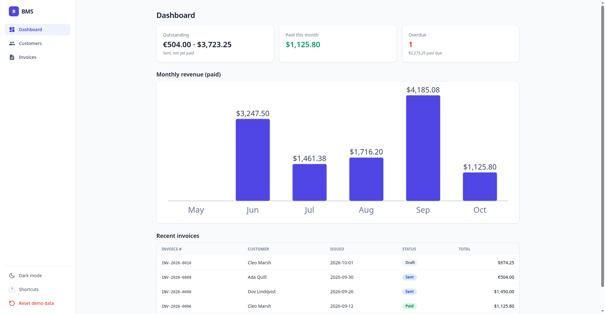
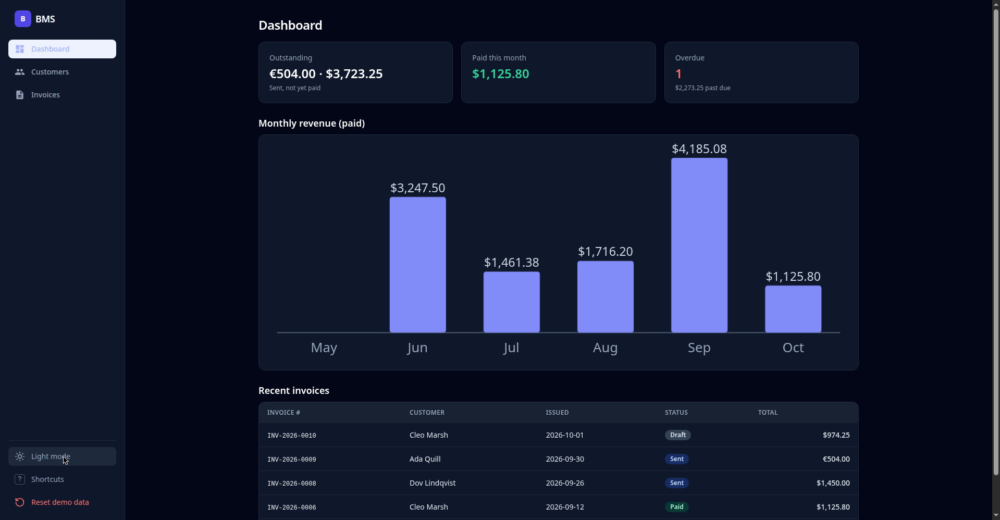
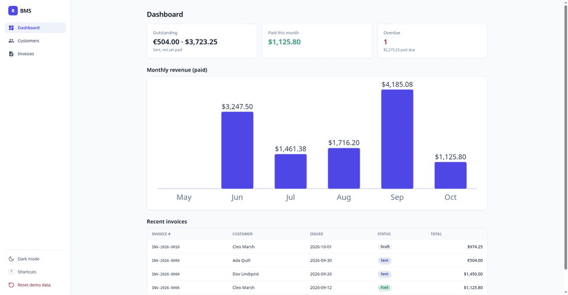
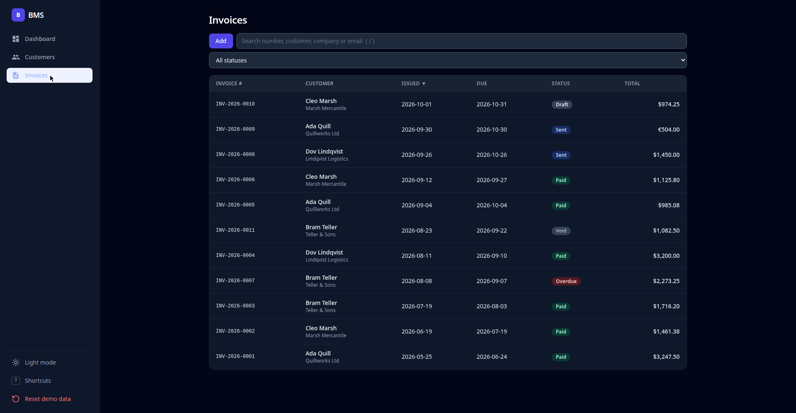
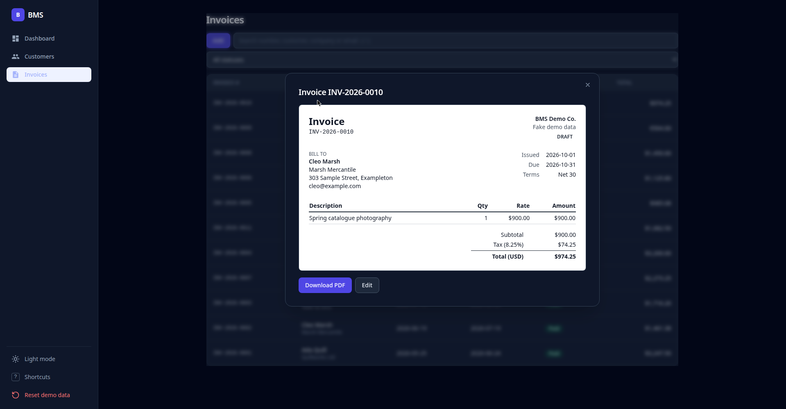

# BMS — Business Management System

A small-business invoicing app: track customers, build invoices with line items, and watch your revenue on a live dashboard. Built as a polished, fully client-side demo — every byte runs in the browser.

**Live demo:** https://vrdevil44.github.io/BMS-project/





## What it does

- **Dashboard** — outstanding totals, paid-this-month, overdue count, recent invoices, and a monthly revenue chart at a glance
- **Invoices** — line items with live totals, tax, per-invoice currency, issue/due dates, payment terms, notes, and statuses (draft / sent / paid / void, with overdue derived automatically)
- **PDF export** — any invoice prints to a clean, paper-styled PDF straight from the browser
- **Customers** — contact records with full invoice history and total billed per customer
- **Search, sort & filter** everywhere, with accessible sort controls
- **Dark mode** — follows your system, toggleable, remembered
- **Keyboard shortcuts** — press `?` in the app for the full list




## Tech

Next.js 13 · TypeScript (strict) · Tailwind CSS · hand-rolled SVG charts · zero runtime backend dependencies. Lint-clean, type-safe, and unit-tested (`npm test`).

Data access is abstracted behind `src/data` (`list/get/create/update/remove`), so the UI never touches storage directly. A PocketBase adapter exists for anyone who wants a real backend (see below).

## Demo data

The hosted demo has no backend. Data lives in your browser's `localStorage` (key `bms-demo-v1`), seeded with obviously fake records (example.com emails, 555 numbers). Use **Reset demo data** in the sidebar to restore the seed.

## Run locally

```bash
npm install
npm run dev      # http://localhost:3000/BMS-project
npm run build    # static export to ./out
npm test         # unit tests
```

## Optional: PocketBase backend

To use a self-hosted [PocketBase](https://pocketbase.io) instead of localStorage:

1. Download PocketBase for your OS and run it from this repo root: `./pocketbase serve` (migrations in `pb_migrations/` create the `addressbook` and `invoicebook` collections).
2. Build/run with `NEXT_PUBLIC_BMS_BACKEND=pocketbase` (and optionally `NEXT_PUBLIC_POCKETBASE_URL`, default `http://127.0.0.1:8090`).
